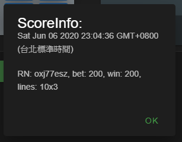

# SlotMachine

這是一個練習使用nodejs、express、vuejs與vuetify相關的專案  
目前實作了一個老虎機

---

## 初始化

此專案需要安裝nodeJs、mongoDB，在專案目錄下執行下列指令
1. `npm install express --save` 安裝express
2. `npm install mongoose` 安裝mongoose套件
3. `node main.js` 執行server
4. 打開瀏覽器瀏覽 `localhost:3000` 就可以看到遊戲畫面

## TODOs

1. 優化盤面滾動表演
2. 優化中獎線表現與中獎線資訊內容

---

## Features
  
布局展示  

  
點選歷史得分展示  

  
中獎線位置資訊(待優化)  

  
遊戲紀錄  